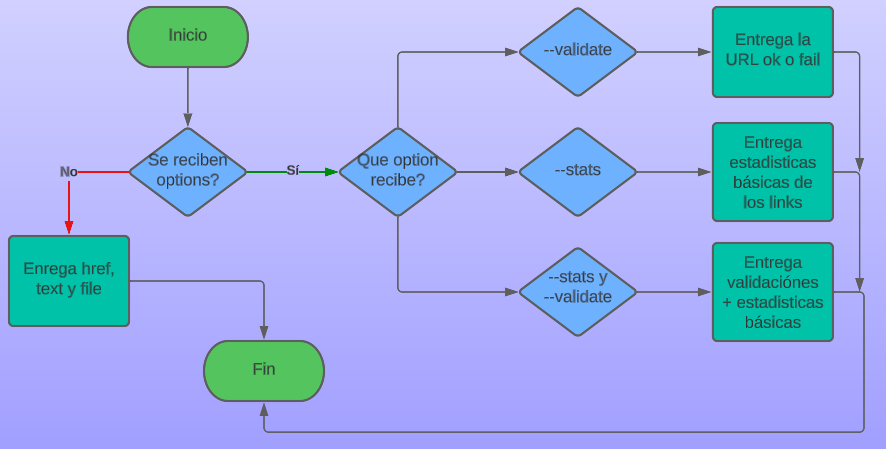

```sh
╔╦═╦╗─────────────╔═╦═╗╔╗╔╗╔╗──╔╗╔═╗
║║║║╠═╦╗╔═╦═╦══╦═╗║║║║╠╝║║║╠╬═╦╣╠╣═╣
║║║║║╩╣╚╣═╣╬║║║║╩╣║║║║║╬║║╚╣║║║║═╬═║
╚═╩═╩═╩═╩═╩═╩╩╩╩═╝╚╩═╩╩═╝╚═╩╩╩═╩╩╩═╝

──────▄▀▄─────▄▀▄
─────▄█░░▀▀▀▀▀░░█▄
─▄▄──█░░░░░░░░░░░█──▄▄
█▄▄█─█░░▀░░┬░░▀░░█─█▄▄█
```

## Resumen del proyecto

Este proyecto consiste en una biblioteca diseñada especialmente para programadores, que les permite verificar si un archivo de tipo MD contiene enlaces y determinar el estado de dichos enlaces (si están funcionando o no).

Se trata de una herramienta de línea de comandos (CLI) y una biblioteca que permite buscar y analizar enlaces en archivos `Markdown (.md)`. La biblioteca está desarrollada en `Node.js` y utiliza la API de Fetch para realizar solicitudes HTTP y validar los enlaces. Además, se incluyen pruebas unitarias con Jest para asegurar la calidad del código. La instalación de esta biblioteca es sencilla, ya que se puede realizar fácilmente a través de npm.


## Diagrama de flujo


## Diagrama del Cli




## 1. Instalación

Se instala con el siguiente comando: 

`npm i md-links-natsama`


## 2. Modo de uso

Desde tu terminal utliza el siguiente comando:

```sh
md-links <ruta_de_archivo_o_directorio >
```

md-links retorna un conjunto de texto que contiene información correspondiente a cada link encontrado:

```sh
    Link: https://nodejs.org/
    Text: Node.js
    File: C:\Users\User\Files\Links.md
```

### al ejecutar:

```sh
md-links <ruta_de_archivo_o_directorio> [--validate]
```

md-links retorna un conjunto de texto que contiene información de la URL encontrada, texto del link, ruta del archivo encontrado, un código de respuesta HTTP y `Not Found` en caso de fallo u `OK` en caso de éxito.

```sh
    Link: https://nodejs.org/
    Text: Javascript
    File: C:\Users\User\Files\README.md
    Status: 404
    StatusText: Not Found
    
    Link: https://nodejs.org/
    Text: Node.js
    File: C:\Users\User\Files\Links.md
    Status: 200
    StatusText: OK 
```    

### Cuando ejecutamos:

```sh
md-links <ruta_de_archivo_o_directorio> [--stats]
```
Este comando solo retornará número total de links encontrados en el archivo y el número de links únicos presentes en el archivo.

`Total: 3 , Unique: 3`


### y finalmente:

```sh
md-links <ruta_de_archivo_o_directorio> [--validate] [--stats]
```
Ese comando retorna: el número total de links encontrados en el archivo, el número de links únicos (que no se repiten) y el número total de los links que no funcionan correctamente.

`Total: 3 , Unique: 3, Broken: 1`
